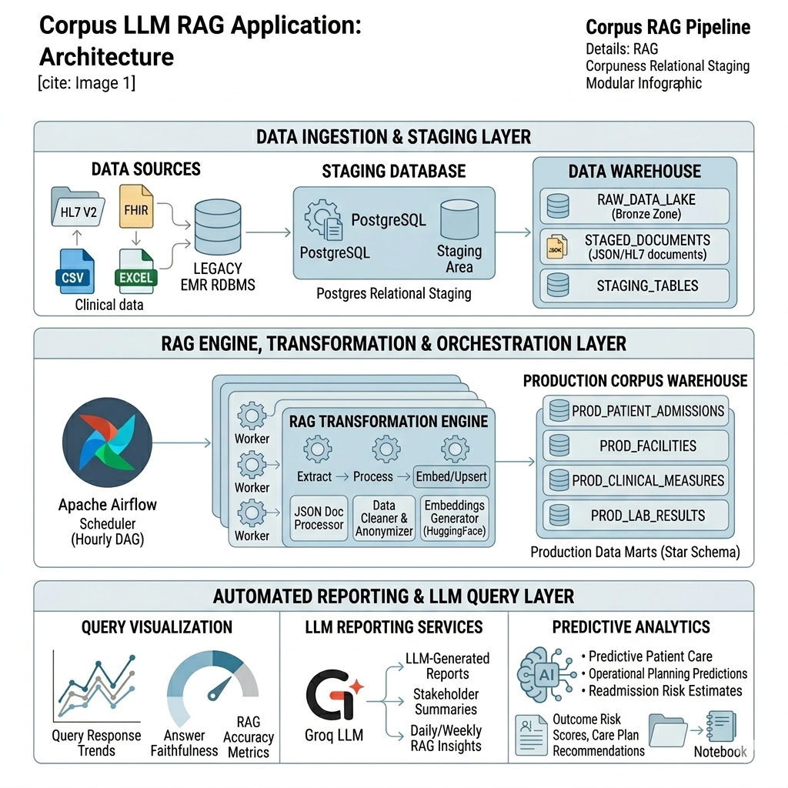

# Corpus Large Language Model Application




## Overview
Enterprise-grade Retrieval-Augmented Generation (RAG) Pipeline
This application enables high-accuracy information retrieval from private policy documents and technical corpora. It leverages LangChain and ChromaDB to transform static documents into a searchable vector space, integrated with Groq/HuggingFace LLMs for natural language synthesis.

- Persistent Vector Store: ChromaDB integration with host-volume mapping for data durability.
- Optimized Inference: CPU-specific PyTorch builds for efficient staging deployment.
- Modular RAG Architecture: Decoupled ingestion and retrieval logic.
- Production-Ready Web Layer: Flask served via Gunicorn for concurrent request handling.
- Automated DevOps: Zero-downtime deployment logic via GitHub Actions and Docker.

---

## Table of Contents
- [Introduction](#introduction)
- [Project Structure](#project-structure)
- [Tech Stack](#tech-stack)
- [Installation & Setup](#installation--setup)
- [Usage](#usage)
- [CI/CD & Deployment](#cicd--deployment)
- [Authors & Acknowledgements](#authors--acknowledgements)
- [License](#license)

---

## Introduction <a name="introduction"></a>
The **Malware Detection Web App** analyzes file characteristics and evaluate it to be **Suspicious, Benign or Highly-Risk**. It ensures **consistent preprocessing, model training, and prediction** through a custom Python pipeline and provides a **real-time web interface** for inference.

---

## Project Structure <a name="project-structure"></a>
```text
├── src/                        # Core application source code
│   ├── app.py                  # Flask web entry point & API routes
│   ├── engine.py               # RAG logic (Vector DB setup, LLM chains, Ingestion)
│   ├── chroma_db/              # Persistent local vector database (SQLite)
│   ├── data/                   # Source corpus (PDF, TXT, HTML, XML, MD)
│   └── templates/              # Flask HTML frontend (index.html)
├── tests/                      # Testing suite
│   ├── test_app.py             # Integration tests for Flask routes
│   └── test_unit.py            # Unit tests for RAG engine logic
├── docs/                       # Project documentation & evaluation metrics
│   ├── ai-tooling.md           # LLM & Embedding configuration details
│   └── design-and-evaluation.md # RAG performance assessment
├── Dockerfile                  # Containerization (optimized for CPU/Staging)
├── requirements.txt            # Python dependencies (CPU-specific PyTorch)
├── setup.sh                    # Environment & dependency bootstrap script
├── setup.py                    # Package metadata for modular installation
└── eval_results.json           # RAG evaluation & accuracy metrics output
```

---

## 📦 Tech Stack
- **Language:** Python 3.11+
- **RAG Framework:** LangChain / LangChain-Community
- **Vector Database:** ChromaDB
- **LLM Providers:** Groq (Llama 3), HuggingFace (Local Embeddings)
- **Web Server:** Flask + Gunicorn
- **Containerization:** Docker (Optimized for CPU/Staging)
- **Dev Tools:** Swagger, Git, VSCode, Linux
- **CI/CD::** GitHub Actions

---


## 📖 Getting Started
### Installation <a name="installation"></a>
#### Prerequisites <a name="prerequisites"></a>
Before running this repo, ensure you have the following prerequisites installed:
- Python 3.11+

### 1. Clone the Repo <a name="Clone the Repo"></a>
```bash
git clone https://github.com/Arshavin023/corpus_llm_rag.git
cd corpus_llm_rag
```

### 2. Create and Activate Virtual Environment <a name="create and activate virtual environment"></a>
```bash
python3 -m venv corpusllmrag_venvvenv
source corpusllmrag_venvvenv/bin/activate  # On Windows: ml_venv\Scripts\activate
pip install -e .
```

### 3. Install Python Packages <a name="Install the required Python packages"></a>
```bash
pip install -r requirements.txt
```

### 5. Usage <a name="usage"></a>
#### a. Run Training Pipeline <a name=" Ingestion, transformation, and model selection process"></a>
```bash
python3 src/engine.py
```
#### b. Run Flask Web App <a name="Run Web App Locally"></a>
```bash
python3 src/app.py 
gunicorn --timeout 120 --bind 0.0.0.0:1762 src.app:app --worker-class gevent --workers 1
rm -rf src/chroma_db src/__pycache__ && python3 src/engine.py && truncate -s 0 src/evaluation/evaluation_results.json && python3 src/evaluate.py && pytest -v
```
#### c. Evaluate LLM <a name="Evaluate LLM & RAG"></a>
- “Groundedness is approximated via substring match between generated and expected answers. Future - work could use semantic similarity or LLM-based evaluation.”
- “We implemented a two-stage retrieval pipeline with re-ranking to improve precision.”

### 6. CI/CD & Deployment <a name="cicd--deployment"></a>
#### Add environment variables in .github/workflows YAML files and deploy the desired branch
```bash
ls -la /home/uche/chroma_data 
docker inspect corpus_llm_rag --format='{{ .Mounts }}'
```

## Authors & Acknowledgements <a name="authors--acknowledgements"></a>
- Developed by Uche Nnodim
- Inspired by best practices in ML pipelines, Flask deployment, and CI/CD automation

## License <a name="license"></a>
- MIT License